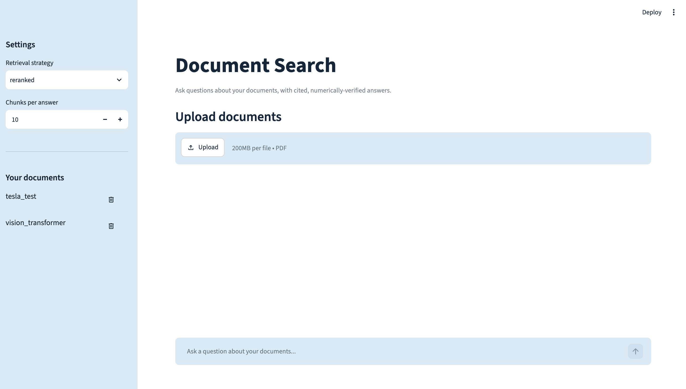
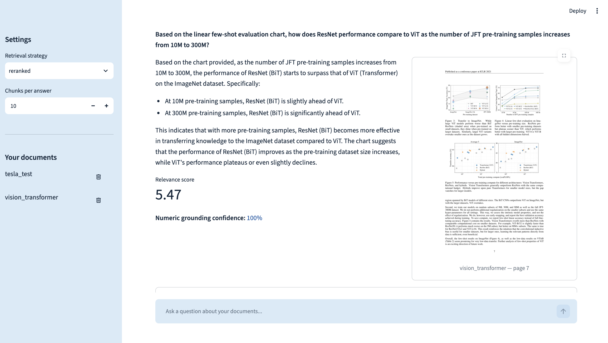

# Multimodal Semantic Search

A local-first RAG (retrieval-augmented generation) system for asking questions about PDFs — financial filings, research papers, or any other document — and getting answers that are **cited, numerically verified, and checkable against the original page**.

Upload a PDF, ask a question, and the app answers strictly from the document, shows a relevance score and a numeric-grounding confidence, and renders the actual PDF page the answer came from so you can verify it yourself instead of trusting a page number.

## Objective

Financial filings and research papers share two properties that make naive RAG unreliable: the answers are mostly **numbers inside tables and charts**, and a wrong number is worse than no answer. This project is built around that:

- **Read what plain-text extraction misses** — tables are parsed into structure, and charts are described by a vision model so their content becomes searchable text.
- **Retrieve well** — dense vector search and keyword (BM25) search are fused, then re-scored by a cross-encoder.
- **Refuse to guess** — the generator is told to answer only from the retrieved passages and to say so when the answer isn't there.
- **Verify the numbers** — every figure in the answer is checked against the retrieved source text within a configurable tolerance; arithmetic is done by a sandboxed executor, not by the LLM.
- **Run on your own machine** — default setup is fully local (Ollama, sentence-transformers, Postgres). Every model-backed component can be swapped for a hosted API through config alone.

## UI Interface

<!-- Add your screenshot at docs/images/ui.png (or change the path below). -->



## Components

| Component | What it does | Default (local) | API alternative |
|---|---|---|---|
| **Parser** | Extracts text, tables (with structure), and chart images with page numbers | Docling (layout model + TableFormer) | — |
| **Parser fallback** | Takes over if the primary parser fails for any reason, not just a missing import | Unstructured | — |
| **Chunker** | Groups elements into chunks: pairs tables/figures with captions, merges tables that continue onto the next page, splits text at a character budget, flattens HTML tables into readable sentences | built-in | — |
| **Vision** | Describes each chart image in text (optionally as structured JSON with data points) so charts are searchable | Ollama `qwen2.5vl:3b` | OpenAI, Together |
| **Embedder** | Turns chunks and queries into vectors | `BAAI/bge-small-en-v1.5` (sentence-transformers) | OpenAI |
| **Vector store** | Stores chunks and vectors; cosine similarity search | Postgres + pgvector (HNSW index) | — |
| **Retrievers** | Dense (vector), BM25 (keyword), and a hybrid that fuses both with Reciprocal Rank Fusion | built-in / `rank_bm25` | — |
| **Reranker** | Re-scores the fused candidates against the question | cross-encoder `ms-marco-MiniLM-L-6-v2` | — |
| **Query analyzer** | Classifies the question (factual / numeric / comparative / temporal) to pick retrieval breadth, whether to run a calculation, and whether to route to a stronger generator | built-in (rule-based) | — |
| **Generator** | Writes the cited answer from the retrieved passages | Ollama `qwen2.5:1.5b` | OpenAI |
| **Program-of-thought executor** | Runs a short LLM-written Python snippet for arithmetic (growth rates, ratios, differences) inside an AST-validated sandbox with a timeout | built-in | — |
| **Numeric-grounding guardrail** | Extracts numbers from the answer and checks each against the source chunks within a tolerance; policy is `flag`, `reject`, or `strip` | built-in | — |
| **PII redactor** | Redacts personal data and financial identifiers in the answer text | Presidio if installed, regex fallback otherwise | — |
| **Evaluator** | Recall@k, MRR, groundedness rate, and optionally RAGAS metrics over a custom dataset, compared against the previous run | built-in / RAGAS | — |
| **UI** | Streamlit app: upload, ask, verify | Streamlit | — |

## Architecture

### Ingestion: PDF to searchable index

```
 PDF  (financial filing, research paper, report)
  │
  ▼
┌──────────────────────────────────────────────────────────────┐
│ Parser        Docling: layout + TableFormer table structure  │
│               + chart image export                           │
│               └─ on ANY failure ─▶ Unstructured (fallback)   │
└──────────────────────────────────────────────────────────────┘
  │  raw elements: text · tables (HTML) · chart images, with page numbers
  ▼
┌──────────────────────────────────────────────────────────────┐
│ Chunker       caption pairing · cross-page table merging ·   │
│               2000-char text budget · HTML tables flattened  │
│               to natural-language rows                       │
└──────────────────────────────────────────────────────────────┘
  │  chunks: text | table | chart
  ▼
┌──────────────────────────────────────────────────────────────┐
│ Vision        (chart chunks only) VLM describes each image;  │
│               the description becomes the chunk's text       │
│               (calls run concurrently, bounded pool of 4)    │
└──────────────────────────────────────────────────────────────┘
  │
  ▼
┌──────────────────────────────────────────────────────────────┐
│ Embedder      BGE (local)  or  OpenAI (API)                  │
└──────────────────────────────────────────────────────────────┘
  │  chunk text + vector
  ▼
 Postgres + pgvector (HNSW, cosine)        data/processed/<doc>.json
```

### Question answering: question to verified answer

```
 Question
  │
  ▼
┌──────────────────────────────────────────────────────────────┐
│ Query analyzer   intent · suggested top_k · is_complex ·     │
│                  use_pot                                     │
└──────────────────────────────────────────────────────────────┘
  │
  ▼
┌──────────────────────────────────────────────────────────────┐
│ Retrieval                                                    │
│                                                              │
│   Dense (vector, top 20) ──┐                                 │
│                            ├─▶ RRF fusion (k=60)             │
│   BM25 (keyword, top 20) ──┘        │                        │
│                                     ▼                        │
│                       top_k × 3 candidates                   │
│                                     │                        │
│                                     ▼                        │
│                Cross-encoder rerank ─▶ top_k chunks          │
└──────────────────────────────────────────────────────────────┘
  │
  ▼
┌──────────────────────────────────────────────────────────────┐
│ Generator   prompt = numbered source passages + question     │
│             rules: answer only from sources · cite [Source N]│
│             · exact figures · say "not available" otherwise  │
│             (complex questions may route to a stronger model │
│              if `generator_complex` is configured)           │
└──────────────────────────────────────────────────────────────┘
  │
  ▼
┌──────────────────────────────────────────────────────────────┐
│ Program-of-thought   (numeric questions only) run the        │
│                      LLM's Python snippet in the sandbox     │
└──────────────────────────────────────────────────────────────┘
  │
  ▼
┌──────────────────────────────────────────────────────────────┐
│ Guardrails   1. numeric grounding vs. source chunks          │
│                 (tolerance 1%, policy: flag/reject/strip)    │
│              2. PII / financial-identifier redaction         │
│              3. append verified calculation, if any          │
└──────────────────────────────────────────────────────────────┘
  │
  ▼
 Answer · grounding ratio · retrieved chunks
  │
  ▼
 UI: answer + relevance score + grounding confidence
     + the rendered source PDF page(s)
```

Two ordering details matter: the calculation code block is stripped from the answer *before* the grounding check (so numbers inside code aren't mistaken for claims), and the verified result is appended *after* it (so a freshly computed figure that appears in no source isn't flagged as ungrounded).

## Evaluation

`mmss evaluate` runs a custom dataset of your own questions through the full pipeline and reports Recall@k, MRR, groundedness rate, and optional RAGAS scores, compared against the previous run.

## Project layout

```
config/                 default.yaml · local.yaml · api.yaml
.streamlit/config.toml  UI theme
src/mmss/
├── config.py           YAML + env config loading
├── registry.py         provider registry: register() / build()
├── cli.py              Typer CLI: ingest · delete · query · ask · evaluate
├── pipeline/           ingest.py · query.py · generate.py · evaluate.py
├── components/
│   ├── parser/         Docling, Unstructured, fallback wrapper, chunker
│   ├── vision/         local (Ollama) and API VLMs, prompts
│   ├── embedder/       local BGE, API
│   ├── vector_store/   pgvector (implemented); chroma, faiss (registered stubs)
│   ├── retriever/      dense, BM25, hybrid (RRF)
│   ├── reranker/       local cross-encoder, noop, API (stub)
│   ├── generator/      local (Ollama), API
│   ├── guardrails/     numeric grounding, PII redaction
│   ├── agentic/        query analyzer, program-of-thought executor
│   └── evaluator/      retrieval metrics, answer metrics, RAGAS
├── ui/app.py           Streamlit app
└── utils/              table flattening, numeric text helpers, concurrency, io
tests/unit/             unit tests
data/                   raw/ processed/ index/ — local only, git-ignored
```

## Testing

```bash
pytest
```

## Future Work

- Support multiple users, with authentication and per-user document isolation, instead of the current single-user setup.
- Add metadata filtering (by document, section, or date) and query rewriting to narrow and sharpen retrieval.
- Cache embeddings so unchanged text is never re-embedded.
- Expose the pipeline through an HTTP API (FastAPI) alongside the Streamlit UI.
- Implement more hosted-API vendors for the embedder, generator and reranker, such as Anthropic, Google, Cohere and Voyage.
- Add containerized deployment and monitoring.

## References

This personal project is inspired by [Mattral/RAG-Multimodal-Financial-Doc-Analysis-and-Recall](https://github.com/Mattral/RAG-Multimodal-Financial-Doc-Analysis-and-Recall).
